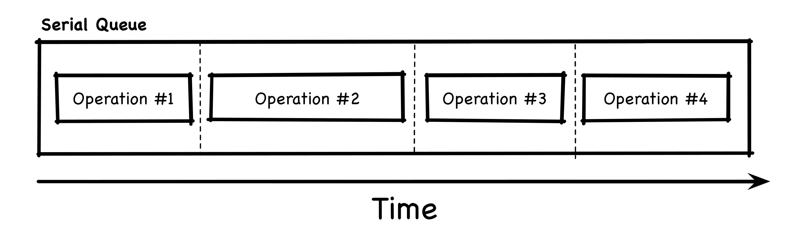

# Essential App Case Study

[](https://github.com/rubyvictor/EssentialFeed-Starter-Project/actions/workflows/CI.yml)


## Image Feed Feature Specs

### Story: Customer requests to see their image feed

### Narrative #1

```
As an online customer
I want the app to automatically load my latest image feed
So I can always enjoy the newest images of my friends
```

#### Scenarios (Acceptance criteria)

```
Given the customer has connectivity
 When the customer requests to see their feed
 Then the app should display the latest feed from remote
  And replace the cache with the new feed
```

### Narrative #2

```
As an offline customer
I want the app to show the latest saved version of my image feed
So I can always enjoy images of my friends
```

#### Scenarios (Acceptance criteria)

```
Given the customer doesn't have connectivity
  And there’s a cached version of the feed
  And the cache is less than seven days old
 When the customer requests to see the feed
 Then the app should display the latest feed saved

Given the customer doesn't have connectivity
  And there’s a cached version of the feed
  And the cache is seven days old or more
 When the customer requests to see the feed
 Then the app should display an error message

Given the customer doesn't have connectivity
  And the cache is empty
 When the customer requests to see the feed
 Then the app should display an error message
```

## Use Cases

### Load Feed From Remote Use Case

#### Data:
- URL

#### Primary course (happy path):
1. Execute "Load Image Feed" command with above data.
2. System downloads data from the URL.
3. System validates downloaded data.
4. System creates image feed from valid data.
5. System delivers image feed.

#### Invalid data – error course (sad path):
1. System delivers invalid data error.

#### No connectivity – error course (sad path):
1. System delivers connectivity error.

---

### Load Feed Image Data From Remote Use Case

#### Data:
- URL

#### Primary course (happy path):
1. Execute "Load Image Data" command with above data.
2. System downloads data from the URL.
3. System validates downloaded data.
4. System delivers image data.

#### Cancel course:
1. System does not deliver image data nor error.

#### Invalid data – error course (sad path):
1. System delivers invalid data error.

#### No connectivity – error course (sad path):
1. System delivers connectivity error.

---

### Load Feed From Cache Use Case

#### Data:
- Max age (7 days)

#### Primary course:
1. Execute "Load Image Feed" command with above data.
2. System retrieves feed data from cache.
3. System validates cache is less than seven days old.
4. System creates image feed from cached data.
5. System delivers image feed.

#### Retrieval error course (sad path):
1. System delivers error.

#### Expired cache course (sad path): 
1. System delivers no feed images.

#### Empty cache course (sad path): 
1. System delivers no feed images.

---

### Load Feed Image Data From Cache Use Case

#### Data:
- URL

#### Primary course (happy path):
1. Execute "Load Image Data" command with above data.
2. System retrieves data from the cache.
3. System delivers cached image data.

#### Cancel course:
1. System does not deliver image data nor error.

#### Retrieval error course (sad path):
1. System delivers error.

#### Empty cache course (sad path):
1. System delivers not found error.

---

### Validate Feed Cache Use Case

#### Primary course:
1. Execute "Validate Cache" command with above data.
2. System retrieves feed data from cache.
3. System validates cache is less than seven days old.

#### Retrieval error course (sad path):
1. System deletes cache.

#### Expired cache course (sad path): 
1. System deletes cache.

---

### Cache Feed Use Case

#### Data:
- Image Feed

#### Primary course (happy path):
1. Execute "Save Image Feed" command with above data.
2. System deletes old cache data.
3. System encodes image feed.
4. System timestamps the new cache.
5. System saves new cache data.
6. System delivers success message.

#### Deleting error course (sad path):
1. System delivers error.

#### Saving error course (sad path):
1. System delivers error.

---

### Cache Feed Image Data Use Case

#### Data:
- Image Data

#### Primary course (happy path):
1. Execute "Save Image Data" command with above data.
2. System caches image data.
3. System delivers success message.

#### Saving error course (sad path):
1. System delivers error.

---

## Flowchart


## Model Specs

### Feed Image

| Property      | Type                |
|---------------|---------------------|
| `id`          | `UUID`              |
| `description` | `String` (optional) |
| `location`    | `String` (optional) |
| `url`	        | `URL`               |

### Payload contract

```
GET /feed

200 RESPONSE

{
	"items": [
		{
			"id": "a UUID",
			"description": "a description",
			"location": "a location",
			"image": "https://a-image.url",
		},
		{
			"id": "another UUID",
			"description": "another description",
			"image": "https://another-image.url"
		},
		{
			"id": "even another UUID",
			"location": "even another location",
			"image": "https://even-another-image.url"
		},
		{
			"id": "yet another UUID",
			"image": "https://yet-another-image.url"
		}
		...
	]
}
```

---

## Image Comments Feature Specs

### Story: Customer requests to see image comments

### Narrative

```
As an online customer
I want the app to load image commments
So I can see how people are engaging with images in my feed
```

#### Scenarios (Acceptance criteria)

```
Given the customer has connectivity
 When the customer requests to see comments on an image
 Then the app should display all comments for that image
```

```
Given the customer doesn't have connectivity
 When the customer requests to see comments on an image
 Then the app should display an error message
```

## Use Cases

### Load Image Comments From Remote Use Case

#### Data:
- ImageID

#### Primary course (happy path):
1. Execute "Load Image Comments" command with above data.
2. System loads data from remote service.
3. System validates data.
4. System creates comments from valid data.
5. System delivers comments.

#### Invalid data – error course (sad path):
1. System delivers invalid data error.

#### No connectivity – error course (sad path):
1. System delivers connectivity error.

---

## Model Specs

### Image Comment

| Property          | Type                    |
|-------------------|-------------------------|
| `id`              | `UUID`                  |
| `message` 	    | `String`			      |
| `created_at`      | `Date` (ISO8601 String) |
| `author` 			| `CommentAuthorObject`   |

### Image Comment Author

| Property          | Type                |
|-------------------|---------------------|
| `username` 	    | `String`			  |

### Payload contract

```
GET /image/{image-id}/comments

2xx RESPONSE

{
	"items": [
		{
			"id": "a UUID",
			"message": "a message",
			"created_at": "2020-05-20T11:24:59+0000",
			"author": {
				"username": "a username"
			}
		},
		{
			"id": "another UUID",
			"message": "another message",
			"created_at": "2020-05-19T14:23:53+0000",
			"author": {
				"username": "another username"
			}
		},
		...
	]
}
```

---

## App Architecture


## FeedStore Implementation Inbox

### Retrieve:
- Empty cache returns empty
- Empty cache twice returns empty (no side-effects)
- Non-empty cache returns data
- Non-empty cache twice returns same data (no side-effects)
- Error returns error (if applicable, e.g., invalid data)
- Error twice returns same error (if applicable, e.g., invalid data)

### Insert:
- To empty cache stores data
- To non-empty cache overrides previous data with new data
- Error (if applicable, e.g., no write permission)

### Delete:
- Empty cache does nothing (cache stays empty and does not fail)
- Non-empty cache leaves cache empty
- Error (if applicable, e.g., no delete permission)

#### Side-effects must run serially to avoid race-conditions

## Anatomy of Dependency Inversion


#### High-level component LocalFeedLoader references the <FeedStore> boundary, which is a protocol (an abstraction with no implementation nor knowledge of low-level implementation details). Such a relationship will make the LocalFeedLoader (high-level core logic) agnostic of the concrete implementations of the boundary abstraction. To complete the inversion, the low-level component, the FeedStore implementation, will have to implement/conform to the requirements of the <FeedStore> boundary.


### Observe the same pattern all over the EssentialFeed project through the architecture diagram


## Make Dependencies Explicit

#### When following the Given/When/Then test structure, as a rule of thumb, every value used in the When and Then portions should be defined in the Given portion.


#### To make the test setup easier to follow/understand, we make all important details explicit by extracting the URL value produced by the testSpecificStoreURL() to a local constant and explicitly inject it as a dependency to the system under test creation (Given part), and then proceed to use it in the When part.


## Serial vs Concurrent queues

#### Serial queues perform operations in sequence:


#### Concurrent queues can perform operations in parallel:


#### When needed, we can block a concurrent queue with a barrier operation:


## Thread-safe(r) Value Types

#### Reference types in Swift (e.g., class) share a single copy of the instance data.

#### When sharing mutable data (references), threading becomes a real challenge. For example, if two threads try to mutate the same instance data at the same time, all types of race conditions can occur (data corruption, crashes…).

#### Value Types in Swift (struct, enum or tuples) are initialized, assigned and passed as arguments as independent instances with their own unique copy of the instance data.

#### Since Pure Value Types* (types formed of only value types) are passed around as unique copies, they don’t share mutable state.

#### In turn, Pure Value Types are thread safe since multiple threads will hold and operate on their own unique copy of the data!

#### Example flow of passing Value Types between threads:


## The Ideal testing pyramid


#### The testing pyramid instructs programmers to focus on unit/isolated tests as the foundation of their testing strategy. At a secondary level, we have integration tests which represent an essential, but a much smaller portion of tests. Finally, the third and smallest level represents end-to-end tests you run through the user interface (aka UI Tests).


#### Without an initial persistence framework choice, we focused on defining the LocalFeedLoader persistence needs via an abstract interface (the protocol). So while test-driving the LocalFeedLoader we defined the <FeedStore> protocol methods (a contract) that any persistence mechanism implementation has to conform to.

#### By introducing the <FeedStore> protocol boundary between these two components and using stubbing and spying techniques we could check that the LocalFeedLoader behaved correctly with a test-specific implementation of the <FeedStore>: the FeedStoreSpy class.

#### We are confident the LocalFeedLoader works as intended even though we didn’t have a real persistence store implementation at the time we developed it!

#### Basically, create a clean boundary between the business logic (high-level) and infrastructure details (low-level) to prevent tight coupling - this is a good design decision!


## Architecture Overview

### Implementing reusable protocol specs:
- Establish a boundary e.g., the `<FeedStore>` protocol between the business logic and the infrastructure implementation.
- Isolates and decouples core business logic from frameworks like Core Data


### Distinct Model representations:
- Separate business logic from frameworks
- Clear separation and model representation of the image feed data per module:


- Core Data models have two-way relationships i.e., `ManagedCache` holds a one-to-many relationship with `ManagedFeedImage`
	- The `cache` relationship is a Core Data implementation detail that should not leak into the `LocalFeedImage` or any other core models.
	- Avoid leaking of implementation details by transforming `ManagedFeedImage` data back into a `LocalFeedImage`, an immutable struct.

	## Separating platform-specific and platform-agnostic components

	1. The EssentialFeed, a platform-agnostic target (platform independent components belong here)
	2. The EssentialFeediOS, an iOS-specific target (iOS dependent components belong here)

	

## UX goals for the Feed UI experience

- [ ] Load feed automatically when view is presented
- [ ] Allow customer to manually reload feed (pull to refresh)
- [ ] Show a loading indicator while loading feed
- [ ] Render all loaded feed items (location, image, description)
- [ ] Image loading experience
		- [ ] Load when image view is visible (on screen)
		- [ ] Cancel when image view is out of screen
		- [ ] Show a loading indicator while loading image (shimmer)
		- [ ] Option to retry on image download error
		- [ ] Preload when image view is near visible